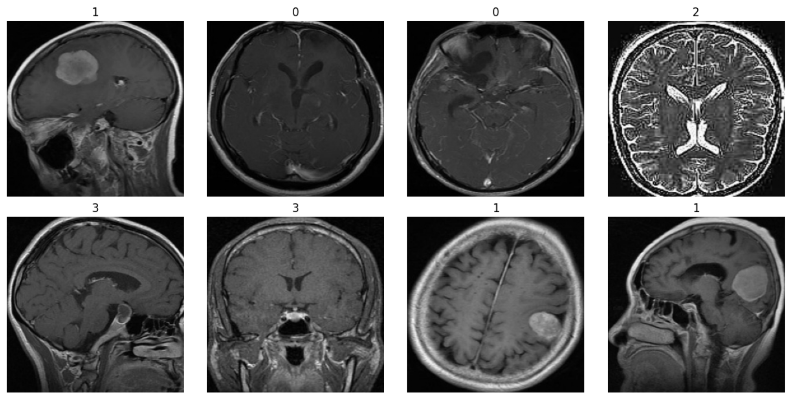

# **DATA 4380 - Computer Vision Project: Brain Tumor Classification from MRI:** 
This repository contains experiments using transfer learning (ResNet50, DenseNet121, MobileNetV2, VGG19, EfficientNetB0) to classify brain tumors using MRI scans from the Kaggle Brain Tumor Dataset: https://www.kaggle.com/datasets/masoudnickparvar/brain-tumor-mri-dataset

## **Overview** 
- The goal was to classify brain MRI images into four categories: glioma, meningioma, pituitary tumor, or no tumor. I used the grayscale MRI images and turned them into a multiclass image classification task using transfer learning and data augmentation to boost performance. Thebest model (DenseNet121 with augmentation) achieved a micro-averaged ROC AUC score of 0.99, with other top models (MobileNetV2 and ResNet50-Augmented) achieving 0.98 and 0.97 respectively.

- ## **Summary of Work Done**
- Data
  - Type: Medical brain MRI images
  - Input: Grayscale JPG images, 224x224, labeled with 4 classes (glioma, meningioma, pituitary tumor, or no tumor)
  - Size: 5712 (around 1428 in each class) training images, 1311 (around 327 per class) testing images
  - Split: 80% train / 20% test
 
  ## **Preprocessing & Clean up**
  - Cropped out margins
  - Normalized pixel values to [0, 1]
  - Used ImageDataGenerator for train/val splits and augmentations
  -  Small Augmentations: rotation, zoom, flip, etc.
 
## **Data Visualization**

These are the cropped and endoded MRIs (Class indices: {'glioma': 0, 'meningioma': 1, 'notumor': 2, 'pituitary': 3})

## **Problem Formulation**
- Input: 224x224 MRI brain image (grayscale -> RGB)
- Output:
  - One-hot encoded vector representing one of the four classes: glioma, meningioma, pituitary tumor, no tumor
- Models:
  - DenseNet121
  - MobileNetV2
  - ResNet50 (with and without augmentation)
  - VGG19 (baseline only)
  - EfficientNetB0
- Hyperparameters
  - Epochs = 10
  - Batches = 32
 
## **Training & Challenges**
Model training was done using a mix of a 2021 MacBook Pro (14-inch, base model) and my Windows PC with an AMD Ryzen 7 5700G, 32GB RAM, and a GTX 760 Ti GPU. I an everything in Jupyter Notebooks using TensorFlow/Keras, with the ImageDataGenerator pipeline to handle image loading and augmentation for the grayscale MRI scans.

I started off with a 2 base models (ResNet50 and VGG19) then and also ran experiments with augmented versions of each architecture to evaluate the impact of data augmentation. Augmentations included horizontal/vertical flips, zoom, rotation, and brightness/contrast changes.

Due to limited time and hardware, so I didn’t do full hyperparameter tuning (I had to switch to my PC after my laptop crashed running the VGG19 with augmentation). Training times varied across models and machines, so they're not listed exactly here, but heavier models like VGG19 and ResNet50 generally took longer, while MobileNetV2 trained more quickly. Then all models were evaluated on the same validation/test split using ROC-AUC (micro), and training curves were saved to visualize performance.

