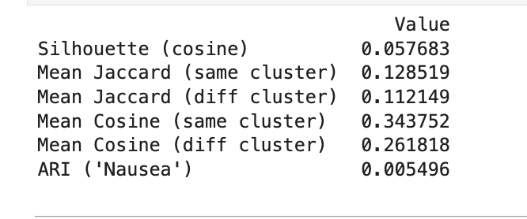
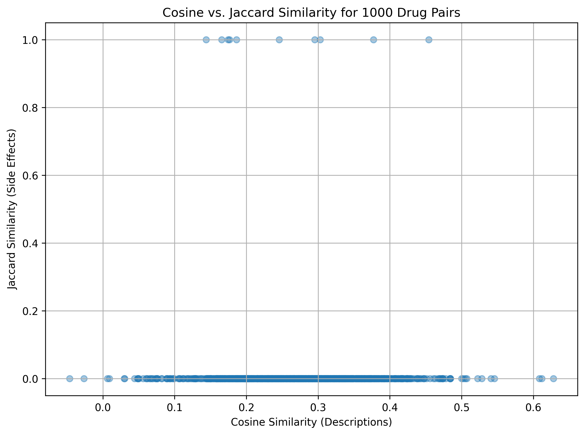
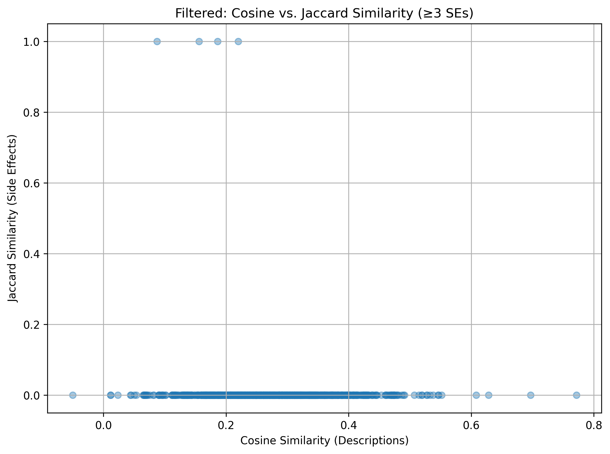
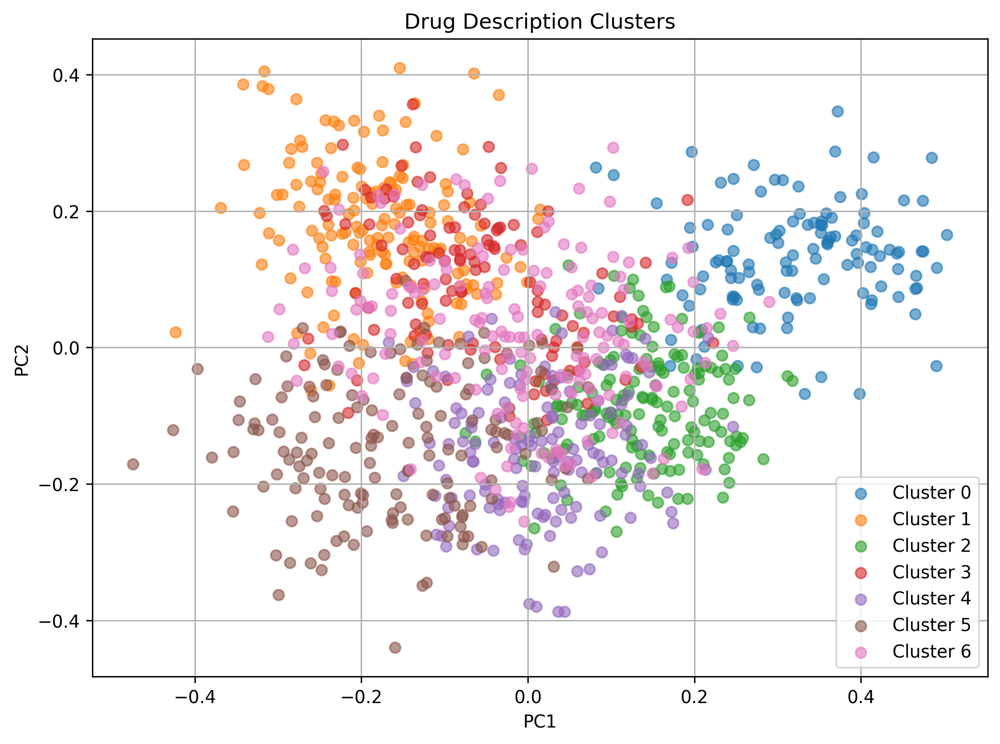
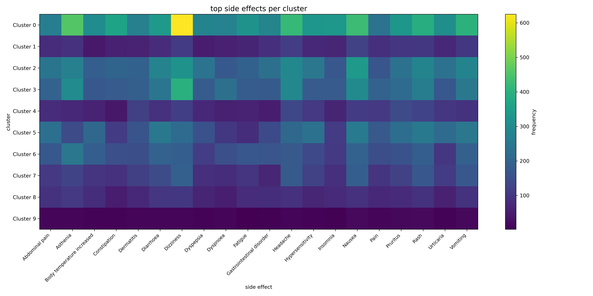
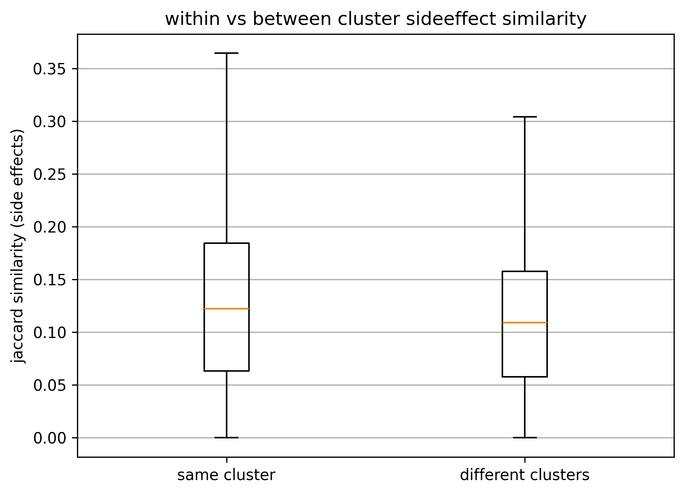

# **DATA 4380 - Drug Similarity Analysis using LLM Embeddings**  
This repository contains experiments using large language model embeddings (all-MiniLM-L6-v2) to analyze drug description similarity from DrugBank and compare it to side effect overlap from SIDER. The project explores cosine similarity, Jaccard similarity, clustering, and multiple evaluation metrics to determine whether similar descriptions align with similar side effects.

## **Overview**  
- The goal was to determine if drugs with similar text descriptions also share similar side effects. I used drug descriptions from DrugBank and matched them with side effect data from SIDER. The descriptions were converted into embeddings using the **all-MiniLM-L6-v2** model from Sentence-Transformers, and cosine similarity was compared with Jaccard similarity of side effect sets. Clustering was performed to group drugs by description similarity, and cluster quality was evaluated using metrics such as Silhouette score, mean cosine similarity, and Adjusted Rand Index (ARI). Results showed weak correlation between description and side effect similarity, with a Silhouette score of 0.058 and ARI of 0.005 for the common side effect "Nausea" as an example.

## **Summary of Work Done**
- **Data**
  - Type: Drug descriptions and known side effects
  - Input: DrugBank XML descriptions, SIDER TSV side effect associations
  - Size: 1,028 matched drugs with both descriptions and side effects
  - Split: Used for unsupervised similarity and clustering analysis (no train/test split)

## **Preprocessing & Clean up**
- Parsed DrugBank XML to extract 'drugbank_id`, `name`, and `description`
- Loaded and cleaned SIDER drug name and side effect files
- Matched drugs between DrugBank and SIDER by lowercase names
- Removed entries with missing descriptions
- Grouped side effects per drug into Python sets
- Generated sentence embeddings for descriptions using `all-MiniLM-L6-v2`

## **Problem Formulation**
- **Input**: Drug description text (from DrugBank XML)
- **Output**: 
  - Cosine similarity scores between drug descriptions
  - Jaccard similarity scores between sets of known side effects
  - Cluster assignments based on description embeddings
- **Models / Methods**:
  - Embedding generation with `all-MiniLM-L6-v2` (Sentence-Transformers)
  - Similarity calculations: Cosine (text), Jaccard (side effects)
  - Clustering: KMeans
  - Dimensionality reduction for visualization: PCA
- **Notebooks & Key Steps**:
  - **Notebook 1 – Feasibility & Preparation** (`LLM_Fesability.ipynb`)
    - Parse DrugBank XML and extract names/descriptions
    - Load & clean SIDER names and side effects
    - Merge datasets and group side effects per drug
    - Generate embeddings with `all-MiniLM-L6-v2`
  - **Notebook 2 – Similarity Analysis** (`LLM_similarity_analysis.ipynb`)
    - Sample 1000 drug pairs, compute cosine and Jaccard similarity
    - Filter pairs with more than 3 side effects
    - Cluster embeddings with KMeans to visualize with PCA   
  - **Notebook 3 – Evaluation** (`LLM_evaluation.ipynb`)
    - Calculated Silhouette score
    - Heatmap of top side effects per cluster
    - Within vs between cluster Jaccard similarity
    - Trace specific side effects across clusters (e.g., “Nausea”)
    - Compute ARI and cosine similarity separation
- **Hyperparameters / Settings**:
  - KMeans clusters = 7
  - Sample size for similarity analysis = 1000 drug pairs
  - Minimum side effects for filtered set = 3
 
## **During Processing & Challenges**
- All work was done in Jupyter Notebooks on a 2021 MacBook Pro (M1 Pro, 16GB RAM) using Python, pandas, NumPy, scikit-learn, and Sentence-Transformers.
- I parsed DrugBank XML, merged it with SIDER side effect data, and generated 384-dimensional embeddings using `all-MiniLM-L6-v2`. Cosine similarity (descriptions) and Jaccard similarity (side effects) were computed for 1000 random drug pairs, followed by KMeans clustering and evaluation with metrics like Silhouette score and ARI.
- Challenges included many drug pairs sharing no side effects (Jaccard ≈ 0). Hyperparameter tuning for clustering was minimal, focusing on qualitative inspection (PCA plots, heatmaps) and basic metrics.

## **Performance Comparison**  
### **Evaluation Metrics Summary**  
**Overall clustering and similarity evaluation metrics:**  

### **Key Visualizations**  

**Cosine vs Jaccard Similarity – All Pairs**  
 

**Cosine vs Jaccard Similarity – Filtered Pairs (more than 3 side effects)**  
  

**PCA Clusters**  

**Top Side Effects by Cluster (Heatmap)**  

**Within vs Between Cluster – Jaccard Similarity**  

## **Conclusions**
Clustering drug description embeddings showed only weak separation (Silhouette = 0.058). Same-cluster pairs had slightly higher cosine and Jaccard similarity than different-cluster pairs, but side effects overlapped heavily across clusters (e.g., Nausea in all groups, ARI = 0.005). Overall, embeddings captured some semantic patterns, but didn’t strongly align with side effect profiles.

## **Future Work**
- Try different numbers of clusters and other clustering settings.
- Test other embedding models made for medical text, like BioBERT.
- Add more drug information, like chemical structures or targets, along with descriptions.
- Try methods that predict specific side effects from the data.
- Use other visualization methods, like UMAP, to see if clusters look clearer.

## **How to Reproduce Results**
1. Download or clone this repository.
2. Obtain datasets:
   - **DrugBank XML file** (requires account and approval from DrugBank).
   - **SIDER TSV files** (`drug_names.tsv` and `meddra_all_se.tsv`) from https://sideeffects.embl.de.
3. Place the dataset files in the appropriate project directory.
4. Run the notebooks in order:
   - `LLM_Fesability.ipynb` : Parse and merge DrugBank and SIDER data, generate embeddings.
   - `LLM_similarity_analysis.ipynb`: Calculate cosine/Jaccard similarities, run clustering, visualize.
   - `LLM_evaluation.ipynb`: Evaluate cluster quality, create heatmaps, trace side effects, compute metrics.

## Overview of Files in Repository
- **LLM_Fesability.ipynb** – Data loading, cleaning, and merging DrugBank & SIDER datasets, generating embeddings.  
- **LLM_similarity_analysis.ipynb** – Similarity calculations (cosine & Jaccard), filtering, clustering, and visualizations.  
- **LLM_evaluation.ipynb** – Evaluation metrics (silhouette, ARI, within/between cluster similarity) and additional insights.  
- **drug_names.tsv** – DrugBank drug names extracted from XML.  
- **meddra_all_se.tsv.gz** – Raw SIDER side effect data.  
- **drug_descriptions_embeddings.csv** – Embeddings for each drug description.  
- **drug_data_with_clusters.csv** – Final dataset with assigned cluster labels.  
- **similarity_scores_all.csv** – Cosine & Jaccard similarity scores for all sampled drug pairs.  
- **similarity_scores_filtered.csv** – Similarity scores for filtered pairs (≥3 side effects).  
- **pngs/** – Folder containing plots and visualizations used in README and analysis.

## Data
- The datasets used in this project come from:
  - **DrugBank** – Drug names and descriptions (requires permission, see https://dev.drugbank.com/guides/drugbank/citing)
  - **SIDER** – Side effects data (https://sideeffects.embl.de)
- Preprocessed and merged data files are available in the repository (e.g., `drug_data_with_clusters.csv`, `drug_descriptions_embeddings.csv`).

## Preprocessing and Organization
- Extracted and lowercased drug names for consistent merging.
- Cleaned SIDER data by removing term type columns, keeping only `stitch_id` and side effect names.
- Merged DrugBank descriptions with SIDER side effects and grouped them per drug.
- Generated sentence embeddings using the **all-MiniLM-L6-v2** model from SentenceTransformers.

## Analysis & Clustering
### Environment:
- All analysis was performed in Jupyter Notebook on a Windows machine (AMD Ryzen 7 5700G, 32GB RAM) and a 2021 MacBook Pro (14-inch).
### Frameworks & Tools:
- Python packages: `pandas`, `numpy`, `matplotlib`, `scikit-learn`, `sentence-transformers`
- Methods: Cosine similarity, Jaccard similarity, KMeans clustering, PCA for visualization

## Performance Evaluation
- Metrics Used: Silhouette score (cosine), Adjusted Rand Index (ARI), mean within/between cluster cosine and Jaccard similarities.
- Evaluation also included:
  - Heatmaps of top side effects by cluster
  - Boxplots comparing within vs. between cluster side effect similarity
  - Tracing specific side effects (e.g., “Nausea”) across clusters
- Final results are summarized in a metrics table and visual plots (see `LLM_evaluation.ipynb`).

## **Citations**
[1] Kuhn, Michael, et al. “The SIDER database of drugs and side effects.” *Nucleic Acids Research*, 2016.  
https://sideeffects.embl.de

[2] DrugBank. “DrugBank Online Database.” DrugBank, 2025.  
https://go.drugbank.com  
(Refer to: https://dev.drugbank.com/guides/drugbank/citing for citation guidelines)

[3] Reimers, Nils, and Iryna Gurevych. “Sentence-BERT: Sentence Embeddings using Siamese BERT-Networks.” *arXiv preprint*, 2019.  
https://arxiv.org/abs/1908.10084

[4] scikit-learn Developers. “Silhouette Score.” scikit-learn Documentation.  
https://scikit-learn.org/stable/modules/generated/sklearn.metrics.silhouette_score.html

[5] “SentenceTransformers Pretrained Models.” sbert.net Documentation.  
https://www.sbert.net/docs/sentence_transformer/pretrained_models.html

[6] “Cosine Similarity for NLP.” Machine Learning Plus.  
https://www.machinelearningplus.com/nlp/cosine-similarity/

[7] “Jaccard Similarity – Definition & Examples.” LearnDataSci.  
https://www.learndatasci.com/glossary/jaccard-similarity/

[8] scikit-learn Developers. “Rand Score.” scikit-learn Documentation.  
https://scikit-learn.org/stable/modules/generated/sklearn.metrics.rand_score.html

